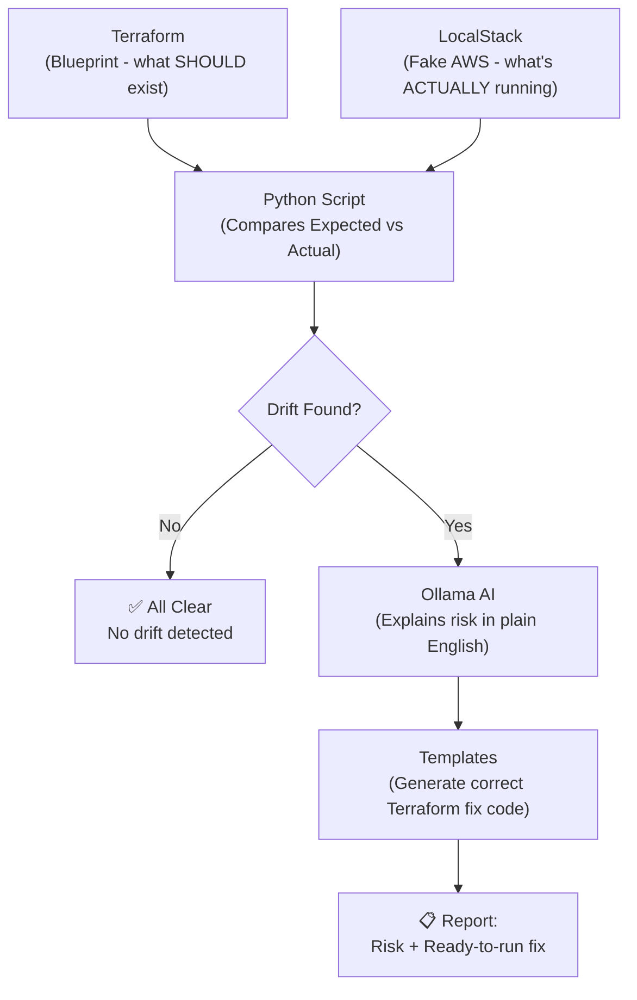

# Cloud Cost & Drift Detective

A CLI tool that detects **configuration drift** between your Terraform-defined
infrastructure and what's actually running in AWS - then explains the risk in
plain English and generates ready-to-run Terraform fixes.

Built to run entirely **offline and free**: [LocalStack](https://www.localstack.cloud/)
emulates AWS, [Ollama](https://ollama.com/) runs the AI locally, no cloud
account or API key required.

## Why this exists

Two common problems in real infrastructure teams:

- **Configuration drift** - someone manually creates/edits a resource in the
  AWS Console, and now Terraform's state no longer matches reality.
- **Forgotten resources** - test environments or one-off instances that never
  get cleaned up, quietly costing money.

This tool audits both, automatically.

## How it works

1. **Terraform** defines the intended infrastructure (source of truth).
2. **LocalStack** emulates a real AWS environment locally, for safe testing.
3. **Python (Boto3)** queries what's actually running and compares it against
   Terraform's state file.
4. **Ollama (Llama 3)** explains the security/cost risk of each finding in
   plain English.
5. Terraform **import commands and resource blocks** are generated from fixed
   templates (not AI) - guaranteeing syntactically correct, runnable fixes.



## Setup

Requires: Docker, Terraform, Python 3.10+, and [Ollama](https://ollama.com/).

```bash
# 1. Start LocalStack (fake AWS)
docker run -d --name localstack -p 4566:4566 \
  -e LOCALSTACK_AUTH_TOKEN=<your-free-token> \
  localstack/localstack

# 2. Start Ollama and pull a model
ollama pull llama3

# 3. Set up Python environment
python3 -m venv venv
source venv/bin/activate
pip install -r requirements.txt

# 4. Apply the example Terraform baseline
cd terraform && terraform init && terraform apply
cd ..
```

## Usage

```bash
python3 drift_detective.py check
```

Flags:

| Flag | Default | Description |
|---|---|---|
| `--terraform-state` | `terraform/terraform.tfstate` | Path to your Terraform state file |
| `--endpoint-url` | `http://localhost:4566` | AWS/LocalStack endpoint |
| `--ollama-url` | `http://localhost:11434` | Ollama server URL |
| `--model` | `llama3` | Ollama model to use |
| `--no-ai` | off | Skip AI risk explanation (faster, works offline/CI) |

Exits with code `1` if drift is found (useful for CI pipelines), `0` if clean.

## Example output

=== RAW FINDINGS ===
* S3 resource running but NOT in Terraform: rogue-test-bucket
=== AI RISK EXPLANATION ===
This untracked S3 bucket may contain sensitive data that isn't properly
secured or monitored, and could incur unexpected storage costs...
=== SUGGESTED FIXES (template-generated) ===
--- Fix for S3: rogue-test-bucket ---
terraform import aws_s3_bucket.rogue_test_bucket rogue-test-bucket
resource "aws_s3_bucket" "rogue_test_bucket" {
bucket = "rogue-test-bucket"
}

## Currently supported resources

- S3 buckets
- EC2 instances
- IAM users

## Design decisions

**Why templates instead of AI for generating Terraform fixes?** Small local
models are reliable at explaining risk in natural language, but not at
generating syntactically correct infrastructure code - a bug here could break
someone's real Terraform apply. Fixed templates guarantee correctness; AI is
used only where its strengths (language, reasoning) actually apply.

## Roadmap

- [ ] Cost-inefficiency detection (idle/low-utilization EC2 instances)
- [ ] Auto-create a GitHub Pull Request with suggested fixes
- [ ] Support additional resource types (RDS, Lambda, VPC)

## Tech stack

Python · Boto3 · Terraform · LocalStack · Ollama (Llama 3)
